<!-- [toc] -->
# 高级Web技术 PJ文档
## 1 成员
### 1.1 成员详情 
组长:郭仲天(19307110250)
组员:张峻安(19307110280) 崔德华(20302010034) 李春阳(19307110196)
### 1.2 团队分工和贡献
|身份|成员|分工|贡献|具体完成工作|
|:---:|:---:|:---:|:---:|:---:|
|组长|郭仲天|前端与文档书写|25%|搭建前端项目框架,书写登录注册,书写选择用户页面和主页,添加人物键盘鼠标控制,构建教学楼模型,碰撞检测,选择教室,以及图片聊天,机器人聊天等功能|
|组员|张峻安|后端与文档书写|25%|构建Socket通信框架，实现多人位置更新，方块放置和删除，聊天和语音的前后端socket代码；编写前后端CI/CD流程配置和dockerfile|
|组员|崔德华|前端|25%||
|组员|李春阳|后端|25%|注册登录及权限验证、课程系统、可视化数据存储、SocketIO及ServiceImpl单元测试、聊天机器人|
## 2 查看网址
### 项目网址
- 助教/老师可以通过下面的网址访问我们的PJ的部署网站
    http://106.14.140.55:10085/
### 代码托管网址
我们的代码托管在`github`上,地址为:
- 前端:
    https://github.com/FuShengDuoBuYu/Advanced_Web_Code_Frontend
- 后端:
    https://github.com/FuShengDuoBuYu/Advanced_Web_Code_Backend
## 3 项目内容
我们小组选择的是PJ2,即`基于Web3D的多人沉浸式学习平台`,我们的项目可以大致分为如下两个部分:
1. 利用`socket.io`和`three.js`实现的3D多人场景
2. 利用`echarts`实现的用户学习数据可视化

从前后端交互的角度,第一部分可以看做基于`socket.io`的3D交互,而第二部分可以看做传统的基于`http`的`restful`交互.

---
### 3.1 项目的使用技术栈
- 前端: `three.js` `socket.io` `echarts` `Angular`
- 后端: `springboot` `mysql` `socket.io` `mybatis`
---
### 3.2 项目的组织结构与文件说明
#### 3.2.1 前端项目结构
前端的项目是基于`Angular`的,我们使用`Angular`的`CLI`工具生成了项目的基本结构,并且使用`Angular Material`作为UI组件库.
具体的**项目结构目录树**如下:
```bash
│  .editorconfig # 编辑器配置文件
│  .eslintrc.json # eslint配置文件
│  .gitignore
│  .npmrc
│  angular.json # angular配置文件
│  dockerfile # docker配置文件,用于CI/CD
│  nginx-angular.conf # nginx配置文件,用于CI/CD
│  package-lock.json
│  package.json # 项目依赖
│  readme.md  
│  tsconfig.app.json
│  tsconfig.json
│  tsconfig.spec.json
│
├─.github
│  └─workflows # github action的配置文件
│          build.yml
│
└─src # 项目源代码
    │  favicon.ico
    │  index.html # 项目入口
    │  main.ts  # 项目入口
    │  styles.css
    │
    ├─app # 项目主要代码
    │  │  app-routing.module.ts
    │  │  app.component.css
    │  │  app.component.html
    │  │  app.component.spec.ts
    │  │  app.component.ts
    │  │  app.module.ts
    │  │  type.ts
    │  │
    │  ├─components # 项目组件
    │  │  │  course.ts  # 课程数据结构
    │  │  │  message.ts # 消息数据结构(用于socket.io的聊天)
    │  │  │  speech_bublle.ts # 语音气泡数据结构
    │  │  │
    │  │  ├─classroom # 教室页面
    │  │  │      classroom.component.css
    │  │  │      classroom.component.html
    │  │  │      classroom.component.spec.ts
    │  │  │      classroom.component.ts
    │  │  │
    │  │  ├─home  # 主页
    │  │  │      home.component.css
    │  │  │      home.component.html
    │  │  │      home.component.spec.ts
    │  │  │      home.component.ts
    │  │  │      platform.ts # 用户的3D显示平台
    │  │  │
    │  │  ├─index # 登录注册页面
    │  │  │      index.component.css
    │  │  │      index.component.html
    │  │  │      index.component.spec.ts
    │  │  │      index.component.ts
    │  │  │
    │  │  ├─notfound  # 404页面
    │  │  │      notfound.component.css
    │  │  │      notfound.component.html
    │  │  │      notfound.component.spec.ts
    │  │  │      notfound.component.ts
    │  │  │
    │  │  ├─personal-center # 个人中心页面
    │  │  │      personal-center.component.css
    │  │  │      personal-center.component.html
    │  │  │      personal-center.component.spec.ts
    │  │  │      personal-center.component.ts
    │  │  │
    │  │  └─select-player # 选择角色页面
    │  │          select-player.component.css
    │  │          select-player.component.html
    │  │          select-player.component.spec.ts
    │  │          select-player.component.ts
    │  │
    │  └─guard  # 路由守卫
    │          loginguard.ts
    │
    └─assets  # 项目资源
        │  .gitkeep
        ├─fbx
        │  ├─anims # 人物动画
        │  ├─people # 人物模型
        │  └─_notes
        │          dwsync.xml
        ├─images # 项目图片与贴图
        ├─model # 首页的3D模型
        │      test.gltf
        ├─pic #表情包图片
        ├─texture #纹理贴图
        └─__MACOSX
```
#### 3.2.2 项目页面逻辑组织
在这里,我们主要有如下几个页面:
- 登录注册页面
- 选择角色页面
- 大厅主页
- 教室页面
- 个人中心页面

在这几个页面之间,用户可以根据自己的动作和需要进行跳转,具体的跳转逻辑如下:

其中各个页面有对应的功能,具体如下:

- 用户可以选择想要进入web3D的虚拟形象,如下图所示
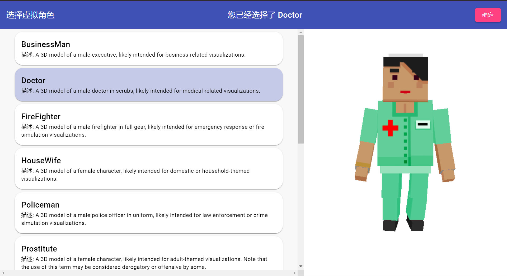
- 用户可以在大厅打开对应的聊天框,并且可以在聊天框中发送消息,如下图所示

- 用户可以在大厅中选择自己想要进入的教室

- 用户在教室可以放置方块,以达到更好的教学交流效果,如下图所示

- 用户可以在个人中心查看自己的课程信息,包括**发言次数,发言时长,所学课程及时间**等,如下图所示

- 更多的系统功能将会在演示视频中展示,如下视频所示:

#### 3.2.2 后端项目结构

---

### 3.2 项目评分点梳理设计与实现
根据Project的评分点,本文档将按照评分点的脉络介绍PJ的设计和实现细节.
#### 3.2.1 UI和交互(10 points)
##### 3.2.1.1 界面美观(5 points)
我们利用`Angular Material`实现了前端的UI组件,这些组件都是经过精心设计的,并且可以在桌面端和移动端良好的适配,如下图所示:
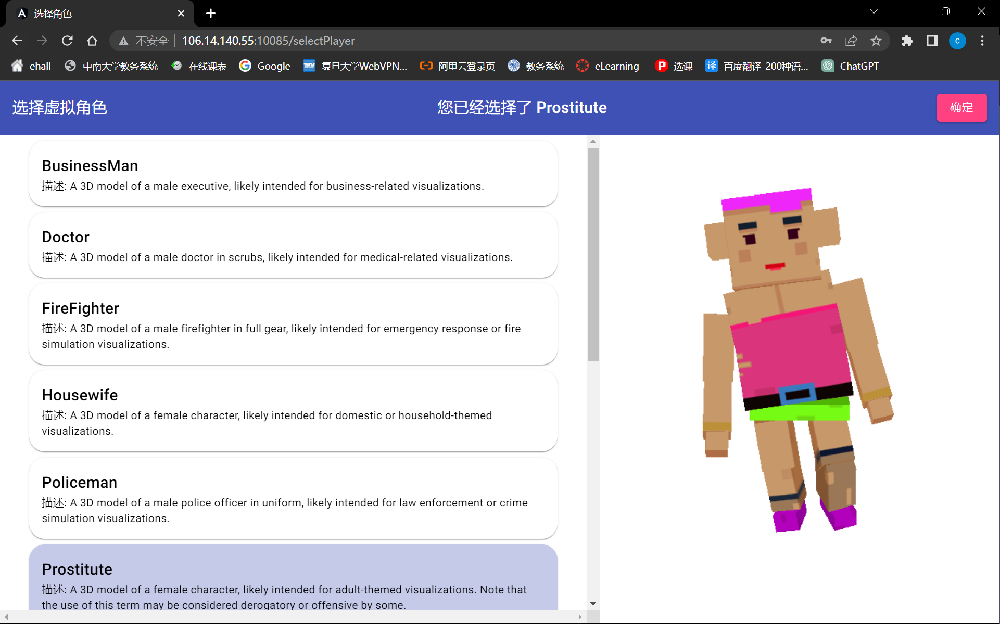

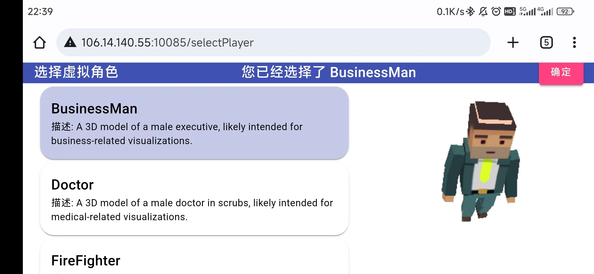
##### 3.2.1.2 交互体验流畅(5 points)
我们认为,最影响用户的体验的因素是用户进入3D场景后的运动和视角转变的帧率和流畅度,因此我们在设计和实现的过程中,尽可能的减少了不必要的计算量,并且在3D场景中,按照lab2的学习文档中的建议,采用了**锁定鼠标**的方式来控制视角的转变,这样可以使得用户在3D场景中的体验更加流畅.
```typescript
//home.component.ts
  playerView(platform, event, platformDiv) {
    //判断当前鼠标是否被锁定
    if(document.pointerLockElement === platformDiv || document.mozPointerLockElement === platformDiv) {
      //鼠标被锁定
      let movementX = event.movementX || event.mozMovementX || event.webkitMovementX || 0;
      let movementY = event.movementY || event.mozMovementY || event.webkitMovementY || 0;
      platform.playerViewControl(movementX, movementY);
    }
  }

//platform.ts
  playerViewControl(dx,dy){
    this.player.object.rotation.y -= dx * 0.002;
    this.camera.rotation.x -= dy * 0.002;
  }
```
通过如上的处理,可以保证用户在3D场景中的体验流畅度.

**注:用户首次进入本网页时,会出现较长时间的等待,原因是因为我们需要加载3D场景中的模型(约20M),这个过程需要一定的时间,我们认为这和服务器带宽相关,和系统整体逻辑流畅度关系不大.**

#### 3.2.2 基本流程(15 points)
##### 3.2.2.1 注册和登录页面(7 points)
###### 3.2.2.1.1 前端:路由守卫
- 在注册和登录页面,我们采用了`Angular Material`提供的`form`组件,并且在`form`组件中,我们使用了`Angular Material`提供的`input`组件.
- 根据lab3中的学习内容,我们实现了路由拦截,当用户未登录时,无法访问其他页面,并且会自动跳转到登录页面.其中实现的原理是`jwt`,每次在页面跳转时,都会调用`loginguard`函数具体的实现细节如下:
> \src\app\guard\loginguard.ts
```typescript
//检验是否有token,如果有token,则可以进行路由跳转,否则跳转到登录页面
export const loginguard : CanActivateFn=(
  ) =>{
  /*console.log('CanActivate守卫：进入当前路由', next, state);*/
      if (localStorage.getItem('token')) {
        return true;
      } else {
        alert("请先登录！");
        window.location.href ='./index';
        return false;
      }
  }
```
###### 3.2.2.1.2 后端:JWT+AOP实现鉴权处理

在这里我们使用了JWT(JSON Web Token)来进行用户的鉴权。在每次登录之后，我们就会调用TokenUtil类来生成一个Token。

> TokenUtil.java

```java
public static String getToken(String id, String username, String role,String password){
    return JWT.create().withAudience(id)
        .withClaim("username", username)
        .withClaim("role", Integer.valueOf(role).equals(ConstVariable.STUDENT) ? "student" : "teacher")
        .withExpiresAt(new Date(System.currentTimeMillis() + EXPIRATION))
        .withIssuedAt(new Date(System.currentTimeMillis()))
        .sign(Algorithm.HMAC256(password));
}
```

在此之后我们Interceptor类，来实现每次请求的PreHandle处理。

> AuthInterceptor.java

```java
@Override
public boolean preHandle(HttpServletRequest request, HttpServletResponse response, Object handler) throws Exception {
    //从请求头中取出token
    String token = request.getHeader("token");
    //如果不是映射到Controller的方法直接放行
    if(!(handler instanceof HandlerMethod)){
        return true;
    }
    HandlerMethod handlerMethod = (HandlerMethod) handler;
    Method method = handlerMethod.getMethod();
    //检查需不需要验证token
    if(method.isAnnotationPresent(VerifyToken.class)){
        if(token == null || token == ""){
            throw new RuntimeException("暂无token信息！请先登录获取token！");
        }
        String userId;
        try {
            userId = JWT.decode(token).getAudience().get(0);
        } catch (JWTDecodeException j){
            throw new RuntimeException("token非法！请重新登录！");
        }
        if(JWT.decode(token).getExpiresAt().compareTo(new Date())<0){
            throw new RuntimeException("token已过期！请重新登录！");
        }
        String password = findUserPassword(userId);
        if(password.equals("")){
            throw new RuntimeException("用户不存在！请重新登录！");
        }
        //验证token
        JWTVerifier jwtVerifier = JWT.require(Algorithm.HMAC256(password)).build();
        try {
            jwtVerifier.verify(token);
        } catch (JWTVerificationException e){
            throw new RuntimeException("token验证失败！请重新登录！");
        }
    }
    return true;
}
```

最终我们使用自定义注解，通过AOP机制来控制controller中的接口是否需要鉴权。

> VerifyToken.java

```java
@Target({ElementType.METHOD, ElementType.TYPE})
@Retention(RetentionPolicy.RUNTIME)
public @interface VerifyToken {
    boolean required() default true;
}
```

在需要鉴权才能使用的接口，我们就在其上方添加`@VerifyToken`即可。

```java
@VerifyToken
@PostMapping("/info")
public Response<?> getUserInfo(...) {
    //...
}
```

##### 3.2.2.2 用户后台页面(8 points)
在用户的后台页面,我们大致将其分成了两个部分:
###### 个人基本信息展示与维护
###### 个人课程信息的图表化展示

#### 3.2.3 3D场景(45 points)
##### 3.2.3.1 正确显示一个可交互的3D场景(15 points)
- 我们的3D场景是学校和教室.用户选定好虚拟角色后,会进入学校的教学楼外.在教学楼外的操场中,用户可以自由的移动,并且可以和其他用户进行交流.
- 当用户走到教学楼的门口时,会自动**显示当前教学楼的名称**以及**当前教学楼中的开设的课程信息**,如下图所示:

<div style="display:flex">
  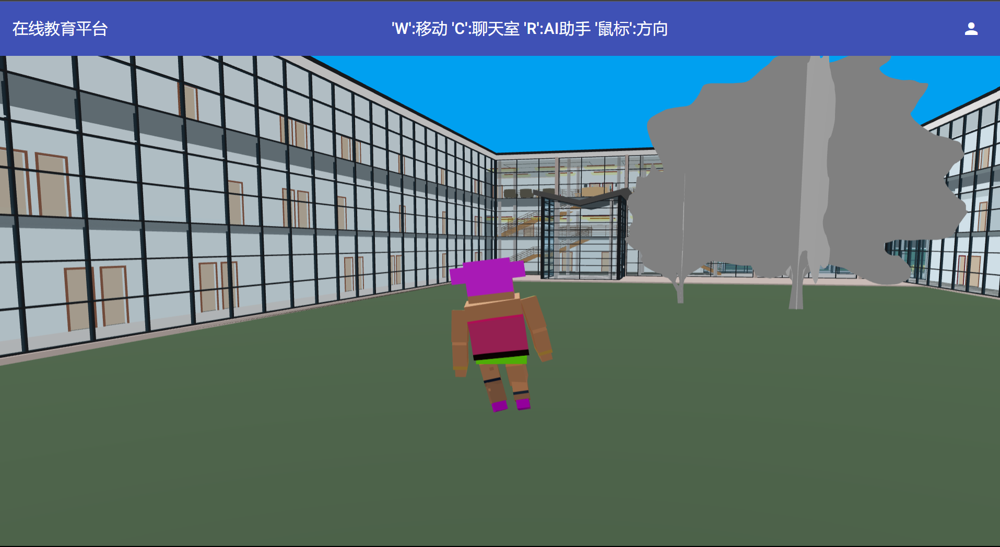
  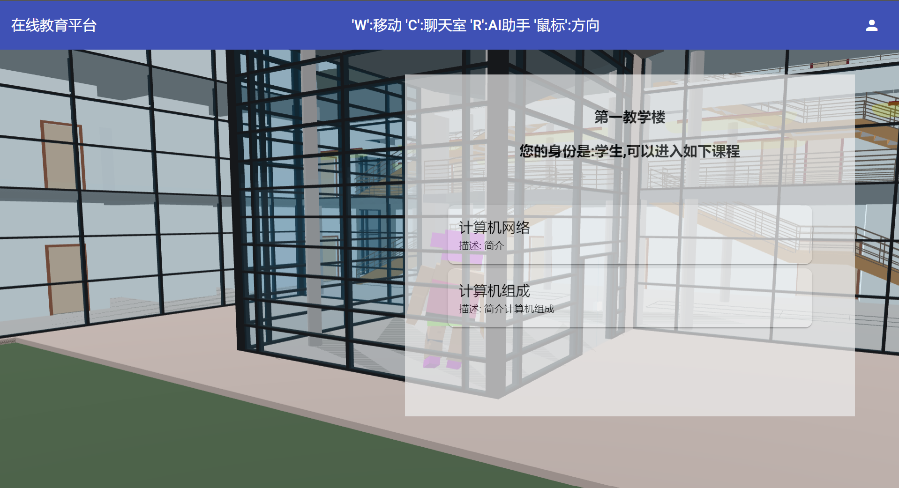
</div>

- 当用户选择点击某个课程后,即可进入该课程的教室,在教室中,用户可以自由的移动,并且可以和其他用户进行交流.

##### 3.2.3.2 场景的创意,功能的完成度和交互的丰富程度(10 points)
- 我们的灵感来自于`Minecraft`,在`Minecraft`中,用户可以通过方块创建出绚丽多彩的各式各样的场景,为了应用这种灵活性,我们决定加入如下功能:**在教室中,老师和学生可以自由地在讲台上放置方块**
- 我们设想,通过放置方块,老师和学生可以通过更好地展示动态的想法和课堂互动.例如,老师可以在讲台上通过放置和销毁方块,展示出`数据结构`中的`栈`和`队列`的特点,并且可以让学生通过放置和销毁方块,来模拟`栈`和`队列`的特点.
- 我们的实现思路和方法如下:
todo:

##### 3.2.3.3 支持多人加入同一个虚拟世界并正确更新其他用户的位置和行为(15 points)
- 我们通过`socket.io`实现了多人在线的功能,并且在3D场景中,实现了多人在线的功能.
- 每当用户移动时,我们会向后端发送用户的位置信息,后端会将用户的位置信息广播给其他用户,其他用户会根据接收到的位置信息,更新其他用户的位置信息.
- 代码如下:
  ```typescript
    this.socket.emit('move', {
      rolename: localStorage.getItem('roleName'),
      username: localStorage.getItem('role') + '-' + localStorage.getItem('username'),
      x: this.player.object.position.x,
      y: this.player.object.position.y,
      z: this.player.object.position.z,
      r: this.player.object.rotation.y
    });
  ```
- 关于更新用户的行为,我们简化用户的行为只有两种:**移动**和**交流**
    - 移动:当前端接收到其他用户的位置发生变化时,则将该用户的动画由**静止**变为**移动**,并且更新该用户的位置信息,反之亦然.
    - 交流:每当前端接收到自己或者其他用户通过聊天框发送了**文字或图片**时,便会在该用户的头顶上方显示出**聊天气泡**,并且在一定时间后消失.
- 篇幅问题,此处就不再赘述代码了,详见`home.component.ts`和`platform.ts`和`speech_bubble.ts`.

##### 3.2.3.4 多用户之间的文字交流(5 points)
- 我们通过`socket.io`实现了多用户之间的文字交流功能.
- 当用户在聊天框中输入文字后,点击发送按钮,则会向后端发送该用户的文字信息,后端会将该用户的文字信息广播给其他用户,其他用户会根据接收到的文字信息,在聊天框中显示出该用户发送的文字信息.
- 代码如下:
```typescript
// 发送消息
  sendMessage() {
    const jsonObject = {
      userName: this.userName,
      message: this.message,
      roomId: this.roomId,
      type: 'text'
    };
    this.socket.emit('chat', jsonObject);
    this.message = '';
  }
// 接收消息
  this.socket.on('chat', (data: { userName: string; message: string,type:string }) => {
        //将接收到的消息显示在聊天框中
        //...
        //将接收到的消息显示在聊天气泡中
        //...
        //...
  });
```

#### 3.2.4 工程能力(20 points)
##### 3.2.4.1 文档(10 points)
- 本文档采用`markdown`编写
##### 3.2.4.2 代码注释与风格(5 points)
- 详见`frontend`和`backend`中的代码
##### 3.2.4.3 系统架构(5 points)
###### 前端
- 前端注重模块化和面向对象(OO)的思想.
  - 模块化:我们将前端的代码按照页面进行模块划分,保证了每个页面的代码基本独立,并且每个页面的代码都在一个文件夹中,便于管理和维护,页面与模块的对应关系如下:
    - 登录注册页面:`/src/app/components/index`
    - 选择虚拟形象页面:`/src/app/components/select-player`
    - 大厅首页:`/src/app/components/home`
    - 教室页面:`/src/app/components/classroom`
    - 个人中心页面:`/src/app/components/personal-center`
    - 404页面:`/src/app/components/not-found`
  - 面向对象:由于大厅页面和教室页面都是可以进行多人在线聊天的,因此我们将其中可以复用的模块用OO的方法抽象出来,以提高复用性:
    - 课程信息:`/src/components/course.ts`
    - 聊天气泡:`/src/components/speech_bubble.ts`
    - 聊天消息:`/src/components/message.ts`
    - ...
###### 后端
Todo:

#### 3.2.5 项目部署(10 points)
##### 将项目部署到服务器上(5 points)
- 项目已经部署到服务器上,可以通过以下链接访问:
  http://106.14.140.55:10085/
- 关于部署的具体内容,可以查看本文档的**4 项目部署**
##### 使用`docker`部署项目(5 points)
- 我们已经使用`docker`部署了前后端,并且将`docker`镜像上传到了`docker hub`上,可以通过以下命令拉取镜像:
- 关于`docker`部署的具体内容,可以查看本文档的**3.3.2.2 持续集成与持续部署(CI/CD)**

### 3.3 进阶功能与附加功能(20 points)
#### 3.3.1 进阶功能
##### 3.3.1.1 简单相应用户虚拟行为的人工智能(5 points)
###### 3.3.1.1.1 人工智能的背景
考虑到我们本次PJ的主题是**在线教育**,因此我们认为,除了老师进行教授知识外,如果能有一个**智能助教**来辅助老师进行教学,那么将会大大提高教学效率,因此我们在教室页面中加入了**智能助教-AI助手**的功能.
###### 3.3.1.1.2 人工智能的作用
我们在聊天框的基础上,新增加了**智能助教-AI助手**的聊天,每个人都拥有一个私密的**智能助教-AI助手**,可以在聊天框中与**智能助教-AI助手**进行交流,并且**智能助教-AI助手**会根据用户的输入,进行相应的回复,如下图所示:

###### 3.3.1.1.3 人工智能的实现
我们分别引入了**复旦大学Moss**模型和**OpenAI GPT-3.5**模型,用户可以自由选择需要选用的模型,通过输入文字便可以获取对应问题的回复.

注1:由于**OpenAI GPT-3.5**模型需要的使用需要`VPN`,因此我们在本地使用是可以的,考虑到法律法规问题,在服务器端的使用暂时并未开放.
注2:**复旦大学Moss**的模型有校外的Api接口,但是复旦信息办的Moss接口的反向代理挂了,需要等复旦信息办修复.而复旦校内的Api是可以用的,在演示视频中会使用复旦大学校园网进行演示该功能.

##### 3.3.1.2 图表化展示后台记录的数据(5 points)

#### 3.3.2 附加功能(10 points)
##### 3.3.2.1 多媒体聊天支持
在PJ的评分标准中,关于多用户之间的交流要求为`文字要求`,但是我们认为,作为在线交流平台,应当拥有较为丰富的交流方式,因此我们在PJ的基础上增加了多媒体聊天的功能,用户可以在聊天框中发送图片,实时语音等多媒体信息.
###### 3.3.2.1.1 图片聊天
用户可以在聊天框中发送图片,以发送`emoji`和图片为例,如下图所示:
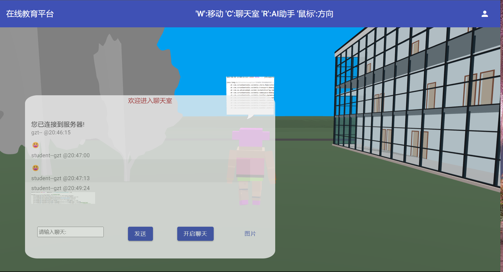

可以看到,用户发送一个`emoji`表情后,用户头顶的对话气泡同样会显示该表情,如果输入的是图片,则会显示图片.
通过这样,用户可以在聊天框中发送图片,以达到更好的交流效果,加强学习的体验感.

在实现时,我们实际上是将图片转为了`base64`进行编码,然后利用`socket.io`将图片的`base64`编码发送给后端,后端再将图片的`base64`编码发送给所有的用户,这样,所有的用户都可以看到发送的图片,代码如下(home.component.ts):
```typescript
//标识type是image,以便前端进行判断
  sendImageMessage(imageMessage:string,) {
    const jsonObject = {
      userName: this.userName,
      message: imageMessage,
      roomId: this.roomId,
      type: 'image'
    };
    this.socket.emit('chat', jsonObject);
  }
```
在聊天框的显示上,利用`*ngIf`进行判断,如果是图片,则显示图片,否则其他的就显示文字,代码如下(home.component.html):
```html
<mat-nav-list style="width: 100%">
    <mat-list-item *ngFor="let message of messages; let i = index" style="height: max-content;">
        <span matListItemLine>{{message.role}}--{{message.username}}   @{{message.time}}</span>
        
        <span matListItemTitle *ngIf="message.type === 'text'" style="display:inline-block;word-wrap:break-word;white-space:normal;font-weight: bolder;">{{message.content}}</span>
        <span matListItemTitle *ngIf="message.type === 'notification'">{{message.content}}</span>
    </mat-list-item>
</mat-nav-list>
```
###### 3.3.2.1.1 实时语音
用户可以在聊天框中开启`实时语音`功能,开启后,当用户说话时,其他用户可以听到该用户的声音,由于语音无法截图显示,这里就不展示了,但是在演示视频中有展示.
我们这里实际并没有采用`WebRTC`技术,而是依然采用了课程上推荐使用的`socket.io`技术,具体的实现方式则是通过每2s采样一次用户的声音,然后将采样的数据发送给后端,后端再将数据发送给所有的用户,这样,所有的用户都可以听到该用户的声音,代码如下(home.component.ts):
```typescript
  startRecording() {
    this.recorder.start();
    const that = this;
    this.recordInterval = setInterval(function () {
      that.recorder.stop();
      let blob: Blob = that.recorder.getWAVBlob();
      that.recorder.start();
      // 编码成为字符串
      const reader = new FileReader();
      reader.readAsDataURL(blob);
      reader.onload = (e) => {
        that.socket.emit('speech', {
          roomId: that.roomId,
          userName: localStorage.getItem('role') + '-' + localStorage.getItem('username'),
          message: reader.result
        });
      }
    }, 2000);
  }

  stopRecording() {
    this.recorder.stop();
    clearInterval(this.recordInterval);
    let blob: Blob = this.recorder.getWAVBlob();
    const reader = new FileReader();
    reader.readAsDataURL(blob);
    reader.onload = (e) => {
      this.socket.emit('speech', {
        roomId: this.roomId,
        userName: localStorage.getItem('role') + '-' + localStorage.getItem('username'),
        message: reader.result
      });
    }
  }
```
##### 3.3.2.2 持续集成与持续部署(CI/CD)
考虑到我们已经按照PJ的要求,将代码部署到服务器中,并且使用了`docker`,因此我们在这里实现了`CI/CD`的功能,使得整个开发部署流水线更加的自动化,也更加符合软件工程的开发规范.
###### 3.3.2.2.1 主要思路
我们的前后端代码都托管在`github`上,于是便采用`Github`推出的持续集成服务:`Github Actions`来实现我们的`CI/CD`功能,具体的实现思路如下:
- 创建一个`Github Actions`的`workflow`,该`workflow`会在`push`到`master`分支时触发,并且会执行相应的打包,构建,此时会生成一个`Aritifact`包,也即打包好的内容.
- 将当前的环境进行`docker build`,生成一个`docker image`,并且将`docker image`推送到`docker hub`上.
- ssh登录到服务器上,拉取`docker image`,并且运行`docker image`,此时,我们的应用就已经部署到了服务器上.
###### 3.3.2.2.2 具体实现
考虑到这实际上是属于项目部署的内容,因此此处就不再赘述,还请查看[项目部署](#4-项目部署)部分.
##### 3.3.2.3 测试驱动的开发(TDD)
作为重要的开发方法论,`TDD`在我们的开发过程中也是必不可少的,我们在开发过程中,也是采用了`TDD`的开发方法.由于前端主要是`3D`的展示,因此主要以手动测试为主.
//TODO
而后端则是采用了**自动化测试**,利用`maven`

---

## 4 项目部署
### 4.1 本地部署
如果需要在本地运行本项目,那么就需要分别运行前端和后端,然后在本地的`localhost`访问即可.

#### 4.1.1 所需依赖
- 前端
  - `nodejs`
  - `npm`
- 后端
    - `java8`
    - `maven`
    - `mysql`

#### 4.1.2 前端运行
1.进入前端目录
```shell
cd frontend
```

2.安装依赖
```shell
npm install (npm i)
```

3.运行
```shell
npm run start
```

此时,前端项目应当已经运行在`localhost:4200`上了,只需要在浏览器中访问该网址即可.
#### 4.1.3 后端运行

### 4.2 服务器部署
根据在`3.3.2.2`中的`CI/CD`的介绍,我们是在`docker`上打包了我们的前后端,并且上传到了`docker hub`上,因此我们只需要在服务器上拉取我们的镜像,然后运行即可.
#### 4.2.1 前端CI/CD与容器化部署
##### 4.2.1.1 使用Github Action实现CI/CD流程

书写`.github/workflows/build.yml`来构建任务

```yaml
name: CI/CD Pipeline
on:
  #Manually trigger workflow runs
  workflow_dispatch:
  #Trigger the workflow on push from the main branch
  push:
    branches:
      - main
jobs:
  build:
    runs-on: ubuntu-latest
    steps:
        - uses: actions/checkout@v2
        - name: Use Node.js
          uses: actions/setup-node@v2
          with: 
            node-version: "14.x"
        - name: Install dependencies
          run: npm install
        - name: Build
          run: npm run build --prod
        - name: Upload Artifact
          uses: actions/upload-artifact@v2
          with:
            name: advanced_web_frontend
            path: dist/advanced_web_frontend
        - name: Build Image
          run: |
            docker build -t annnfdu/advanced_web_frontend .
        - name: Login to Registry
          run: docker login --username=${{ secrets.DOCKER_USERNAME }} --password ${{ secrets.DOCKER_PASSWORD }}
        - name: Push Image
          run: |
            docker push annnfdu/advanced_web_frontend
        - name: Deploy to Server
          uses: appleboy/ssh-action@master
          with:
            host: ${{ secrets.HOST }}
            username: ${{ secrets.HOST_NAME }}
            password: ${{ secrets.HOST_PASSWORD }}
            port: ${{ secrets.HOST_PORT }}
            script: |
              docker pull annnfdu/advanced_web_frontend
              docker stop zja_advanced_web_frontend
              docker rm zja_advanced_web_frontend
              docker run -d --name zja_advanced_web_frontend -p 10085:80 annnfdu/advanced_web_frontend
```
这个yml文件中，`on`制定了workflow出发的机制，表示每次在主分支push都会运行该流水线。

`jobs`为相关工作内容：`names`是任务描述，`uses`是使用相关部署资源，`with`是相关资源的配置，`run`和`	script`是命令内容。

该流水线的流程为：

+ npm install/npm build生成dist包
+ 生成可交付的软件制品
+ 打包docker镜像并更新docker hub中的镜像
+ 登陆远程服务器，拉取最新镜像并运行

通过GitHub Action的使用，我们一次push，就能够在几分钟之后访问服务器端口获取最新的服务

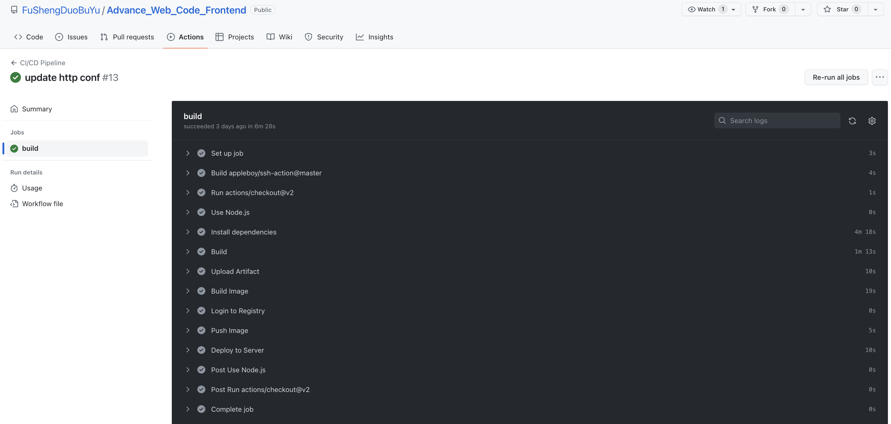

最终生成的dist包也会存储在github页面：

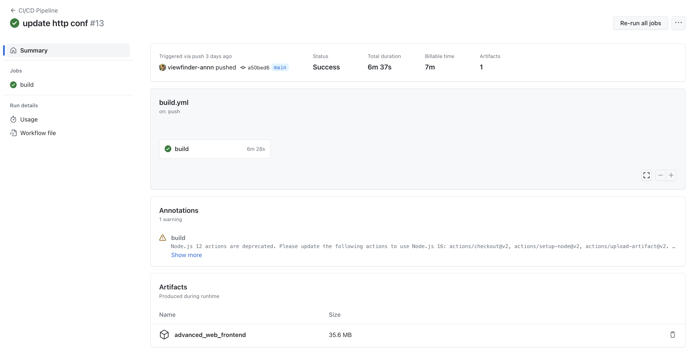


##### 4.2.1.2 编写dockerfile进行容器化部署

我们使用了nginx服务器的docker镜像来容器化前端应用，其中由于Angular的路由机制和nginx默认路由机制存在差别，就需要在dockerfile中自行更换.conf文件来适配Angular应用。

> nginx-angular.conf

```
server {
  listen 80;

  location / {
    root /usr/share/nginx/html;
    index index.html;
    try_files $uri $uri/ /index.html;
  }
}
```

> docker file

```dockerfile
FROM nginx:1.17
COPY dist/advanced_web_frontend /usr/share/nginx/html
COPY ./nginx-angular.conf /etc/nginx/conf.d/default.conf
```

#### 4.2.2 后端CI/CD与容器化部署
##### 4.2.2.1 使用Github Action实现CI/CD流程

书写`.github/workflows/build.yml`来构建任务

```yaml
name: CI/CD Pipeline
on:
  #Manually trigger workflow runs
  workflow_dispatch:
  #Trigger the workflow on push from the main branch
  push:
    branches:
      - main
jobs:
  build:
    runs-on: ubuntu-latest
    steps:
      - uses: actions/checkout@v2
      - name: Set up JDK 8
        uses: actions/setup-java@v2
        with:
          java-version: '8'
          distribution: 'adopt'
      - name: Build with Maven
        run: mvn -B package --file pom.xml
      - name: Test with Maven
        run: mvn test --file pom.xml
      - name: Upload artifact for deployment job
        uses: actions/upload-artifact@v2
        with:
          name: java-app
          path: target/*.jar
      - name: Build Image
        run: |
          docker build -t annnfdu/advanced_web_backend .
      - name: Login to Registry
        run: docker login --username=${{ secrets.DOCKER_USERNAME }} --password ${{ secrets.DOCKER_PASSWORD }}
      - name: Push Image
        run: |
          docker push annnfdu/advanced_web_backend
      - name: Deploy to Server
        uses: appleboy/ssh-action@master
        with:
          host: ${{ secrets.HOST }}
          username: ${{ secrets.HOST_NAME }}
          password: ${{ secrets.HOST_PASSWORD }}
          port: ${{ secrets.HOST_PORT }}
          script: |
            docker pull annnfdu/advanced_web_backend
            docker stop zja_advanced_web_backend
            docker rm zja_advanced_web_backend
            docker run -d --name zja_advanced_web_backend -p 10086:10086 -p 10088:10088 annnfdu/advanced_web_backend
```

这个yml文件中，`on`制定了workflow出发的机制，表示每次在主分支push都会运行该流水线。

`jobs`为相关工作内容：`names`是任务描述，`uses`是使用相关部署资源，`with`是相关资源的配置，`run`和`	script`是命令内容。

该流水线的流程为：

+ mvn package打包jar包
+ mvn test运行test
+ 生成可交付的软件制品
+ 打包docker镜像并更新docker hub中的镜像
+ 登陆远程服务器，拉取最新镜像并运行

通过GitHub Action的使用，我们一次push，就能够在几分钟之后访问服务器端口获取最新的服务

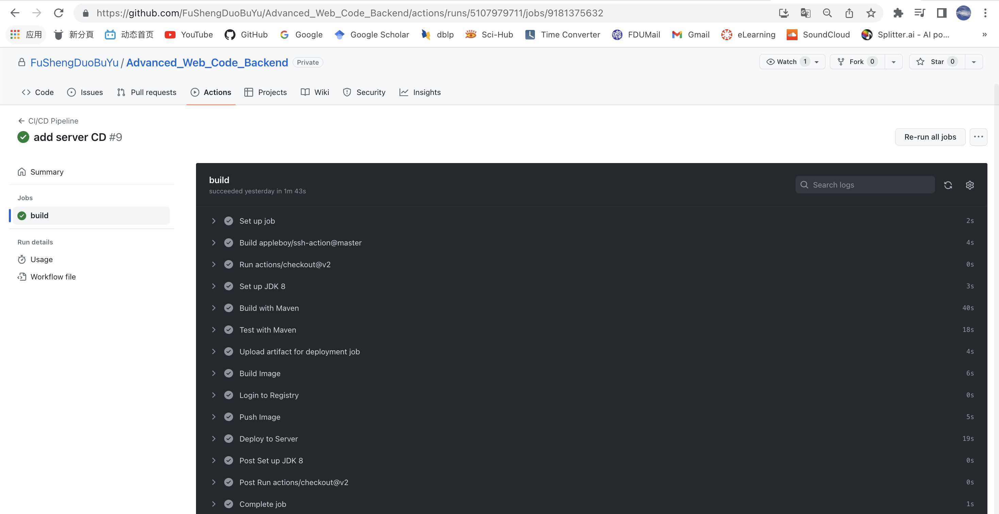

构建失败也会有相关提示：

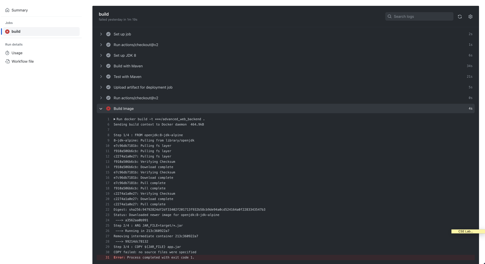

最终生成的软件jar包也会存储在github页面：

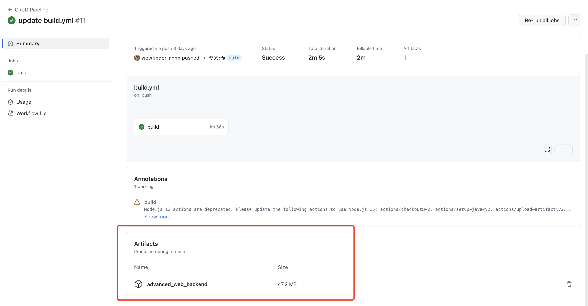


##### 4.2.2.2 编写dockerfile进行容器化部署

在这里我们使用了两个容器来部署后端：MySQL容器和Springboot容器

+ MySQL容器

  在这里给出相关的bash命令

  ```bash
  docker pull mysql:8
  docker run --name mysql1 -p 10087:3306 -e MYSQL_ROOT_PASSWORD=123456 -d mysql:8
  docker ps
  docker exec -it mysql1 /bin/bash
  mysql -uroot -p123456
  ```

+ Springboot容器

  在这里展示Dockerfile

  ```dockerfile
  FROM openjdk:8-jdk-alpine
  ARG JAR_FILE=target/*.jar
  COPY ${JAR_FILE} app.jar
  ENTRYPOINT ["java","-jar","/app.jar"]
  ```
---
## 5 接口文档
